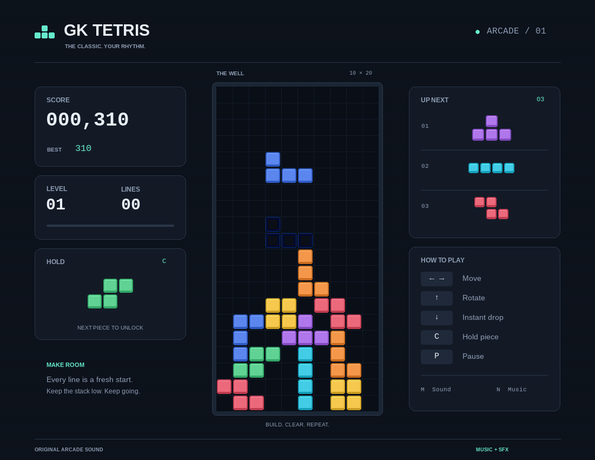

# GK Tetris

A desktop falling-block game with colorful beveled blocks, a dark arcade
interface, and original synthesized chiptune music. Built with Python and
[Pygame Community Edition](https://pyga.me/).



## Run

Requires Python 3.10 or newer and a Linux graphical desktop. From the project
directory:

```sh
python3 -m venv .venv
.venv/bin/python -m pip install -e .
./run.sh
```

You can also run `.venv/bin/python -m gktetris`, or activate the virtual
environment and run `gktetris`. Dependencies are pinned in `pyproject.toml` and
`requirements.txt`. No downloaded graphics, music, account, or network connection
is needed after installation.

## Controls

| Key | Action |
| --- | --- |
| Left / Right | Move; hold to repeat |
| Up | Rotate clockwise with wall kicks |
| Down | Instantly drop and lock in the current orientation |
| C | Hold or swap a piece, once per placement |
| Enter | Start, resume, or play again |
| P | Pause / resume |
| Escape | Pause during play; exit from other screens |
| M | Mute / unmute all audio |
| N | Toggle background music |

Down drops **one piece per keypress**. The outlined ghost shows where it will
land. The latest held horizontal direction wins when both arrows are held.
Losing window focus automatically pauses; press Enter or P to resume.

## Rules

- Seven tetrominoes drawn from shuffled seven-piece bags, with a three-piece
  preview, hold slot, and clockwise SRS wall kicks.
- Clear full rows on a 10×20 board. Single, double, triple, and four-line clears
  earn **100, 300, 500, and 800 × level** points. Hard drops earn two points per row.
- Every ten cleared lines increases the level. Gravity starts at one row per
  second and accelerates to a minimum of 80 ms per row.
- Pieces lock after 500 ms of ground contact. Movement and rotation can reset
  the timer up to 15 times; hard drop locks immediately.
- A blocked spawn or a piece locking above the visible board ends the run.

The resizable window preserves the playfield's proportions. Best score and
sound preferences are saved to `$XDG_CONFIG_HOME/gktetris/settings.json`, or
`~/.config/gktetris/settings.json` by default. The game continues if settings
cannot be saved or if no audio device is available.

## Development and verification

```sh
.venv/bin/python -m unittest discover -v
./run.sh --smoke-test --screenshot artifacts/start.png
```

Tests use SDL's dummy video/audio drivers. The smoke command renders five frames,
writes an optional screenshot, and exits without changing saved preferences.
Normal play uses the real display and audio device.

- `gktetris/model.py`: deterministic board, pieces, timing, rotation, and scoring.
- `gktetris/app.py`: desktop UI, keyboard repeat, lifecycle, and effects.
- `gktetris/audio.py`: original procedural melody and sound effects.
- `gktetris/storage.py`: validated settings and atomic persistence.
- `tests/`: rules, input, rendering, audio fallback, and persistence checks.

See [PLAN.md](PLAN.md) for the agreed implementation and public GitHub publishing
plan. This is an independent Tetris-style project, not an official Tetris product.
